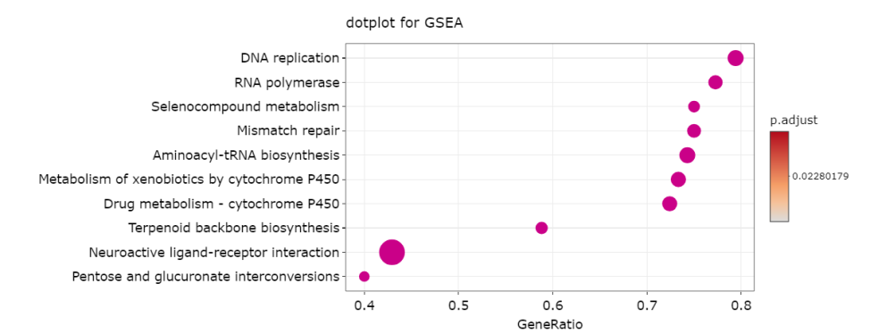
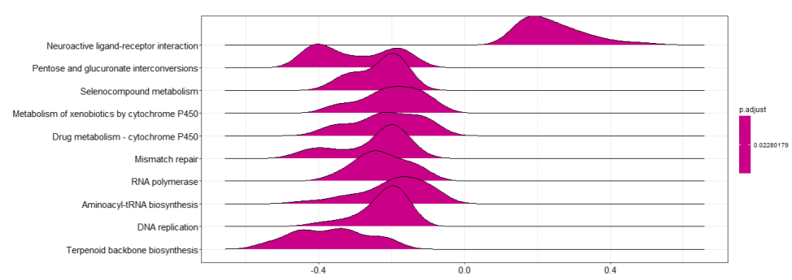

# EASE - Enrichment Analysis Shiny Environment

EASE is an application to study the comprehensive functional analysis of a large gene set with 3 important fields integration : Pathways, gene ontology and protein domains

PACKAGES - Installation
---

```R
anyLib.packages=c("shiny", "shinydashboard", "shinydashboardPlus", "shinycssloaders", "shinyalert", 
                  "ggplot2", "DT", "clusterProfiler", "enrichplot", "org.Dr.eg.db", "KEGG.db", "KEGGREST", 
                  "msigdbr", "dplyr", "pathview", "DOSE", "PPInfer")
anyLib::anyLib(anyLib.packages, autoUpdate = T)
```

Test dataset
---
The test [dataset](https://www.ncbi.nlm.nih.gov/geo/query/acc.cgi?acc=GSE129081) on Danio rerio (Zebrafish) is extracted from the following [paper](https://www.nature.com/articles/s41588-019-0475-y) published in Nature in 2019. 


Summary
---


*File Browse : csv file with header*
id Gene	baseMean log2FoldChange pvalue padj Biotype Orthologous_human_gene


	#Respect header order
	#Specifiy specie


*Volcano Plot & MA plot*


	#Two sliders to specify log(CPM)cetoff and padj on the plots
	#clickable point on plots to show line af the corresponding point


Pathways - SEA & GSEA
---

*Descriptive table of data*

	#Donwloadable 
	#Clickable links


*Dot plot with pathways significantly enriched as a function of the gene ratio (number of genes in the dataset differentially expressed on the number of genes that make up the pathway)*

	#Specifiy number of category





*Pathway Viewer*

	#drop-down list to choose pathway to see


*GSEA only Ridge plot*

	#Specifiy number of category





Domains - SEA & GSEA
---

*Descriptive table*

	#Donwloadable 
	#Clickable links

*Dot plot with domains significantly enriched as a function of the gene ratio (number of genes in the dataset differentially expressed on the number of genes that make up the pathway)*

	#Specifiy number of category


*Bonus with patterns for GSEA*

	#Descriptive table
	#Dot plot
	#Ridge plot


GO 
---

*Representation of main differentially expressed Biological Processes*
	# SEA Histogram with corresponding descriptive table 
	# GSEA Barplot with correspondong descriptive table 


*Representation of main differentially expressed Cellular Component*

	# SEA Histogram with corresponding descriptive table 
	# GSEA Barplot with correspondong descriptive table


*Representation of main differentially expressed Molecular fonction*
	# SEA Histogram with corresponding descriptive table 
	# GSEA Barplot with correspondong descriptive table


## Appendix and FAQ

:::info
**Find this document incomplete?** Leave a comment!
:::

